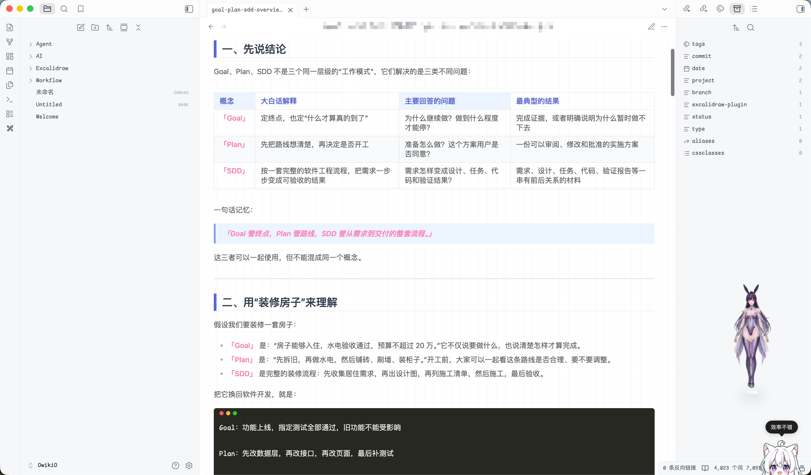

# obsidian-md-skin

Obsidian CSS Snippet 合集。目前包含：

- **typora-indigo** —— 从 VS Code「Markdown Preview Enhanced」插件的 `typora-indigo.css` 预览主题迁移而来。仅作用于阅读视图配色，同时拉宽编辑（实时预览）与阅读视图的行宽（覆盖"可读行宽"）。



| 亮色（theme-light） | 暗色（theme-dark） |
|---|---|
| 忠实还原原主题：白底方格纸、靛蓝强调、标题竖线 | 同色系推导：深靛蓝底、提亮强调色 |

## 安装

1. 把 `snippets/` 里想要的 `.css` 文件放进你的 vault：`<vault>/.obsidian/snippets/`
2. Obsidian → 设置 → 外观 → 拉到底部「CSS 片段」，点刷新图标，打开对应开关
3. 切到阅读视图（Cmd+E）查看效果

## 特性（typora-indigo）

- 白底方格纸背景、靛蓝 `#5a67d8` 强调色
- 标题 h1/h2 左竖线 + 底边框
- 加粗自动包裹「」（原主题特征）
- 代码块 Monokai 深底 + macOS 红绿灯（亮暗一致）
- 表格淡蓝表头 + 斑马纹；引用块淡蓝圆角
- 行宽铺满面板（覆盖可读行宽限制）
- 亮暗由 Obsidian 基础主题（跟随系统/亮色/暗色）决定，与所选外观主题无关，不依附任何主题

## 自定义

所有颜色集中在文件顶部的 `--ti-*` CSS 变量里，改变量即可换肤；暗色版只需覆盖 `.theme-dark` 下的同名变量。

## 目录结构

```
obsidian-md-skin/
├── README.md
├── snippets/          # snippet 本体，安装时拷进 vault
│   └── typora-indigo.css
└── assets/            # 截图等静态资源，按皮肤名前缀命名
    └── typora-indigo-screenshot.png
```
